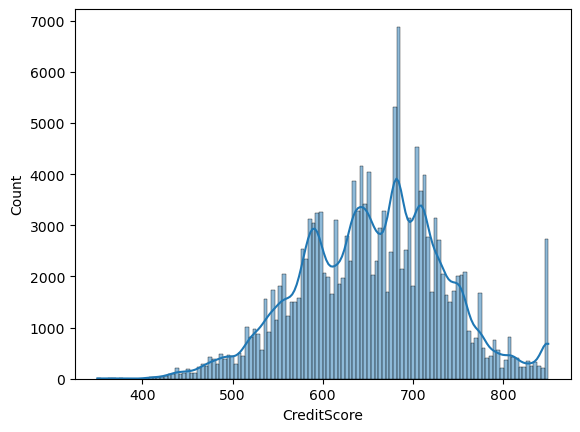
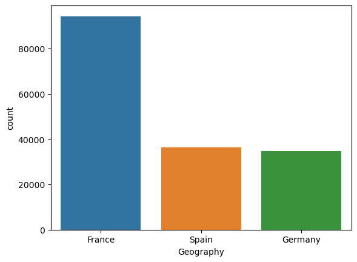
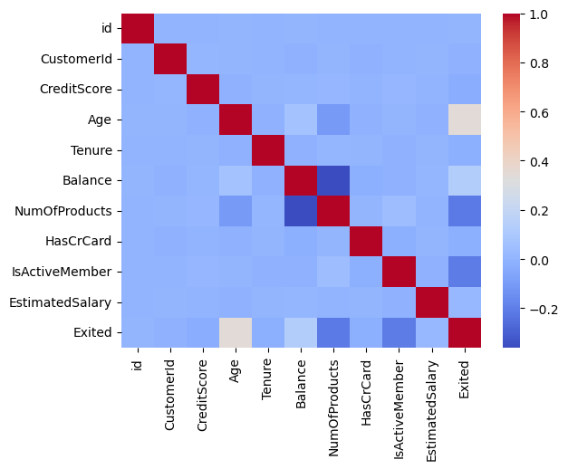
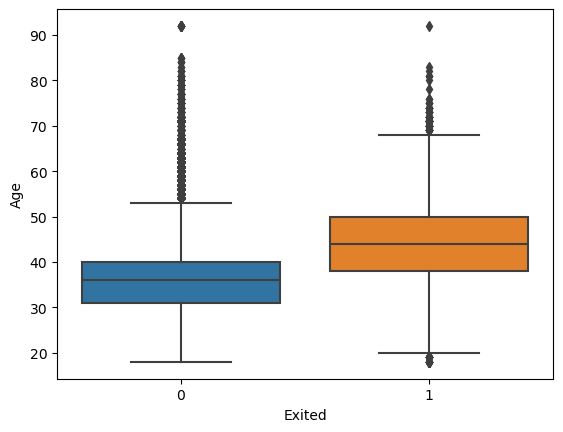
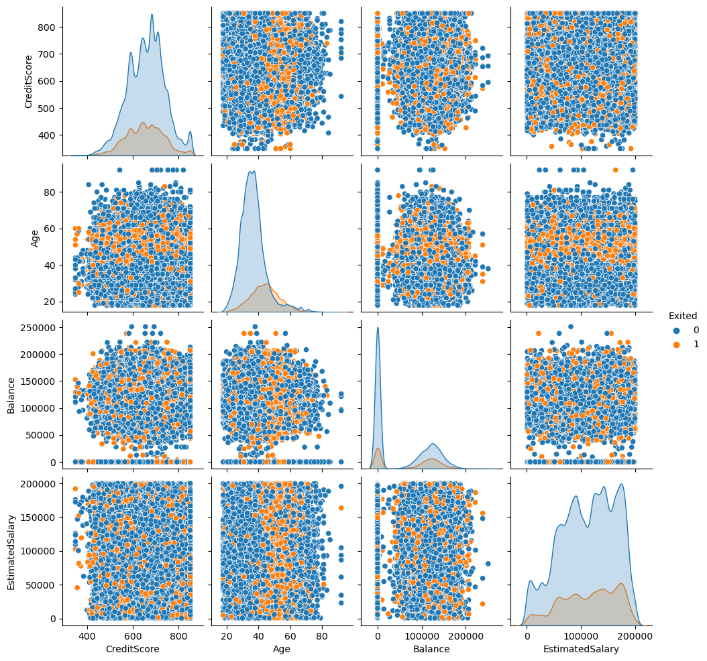
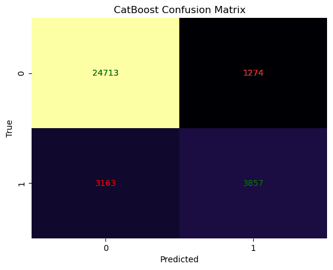
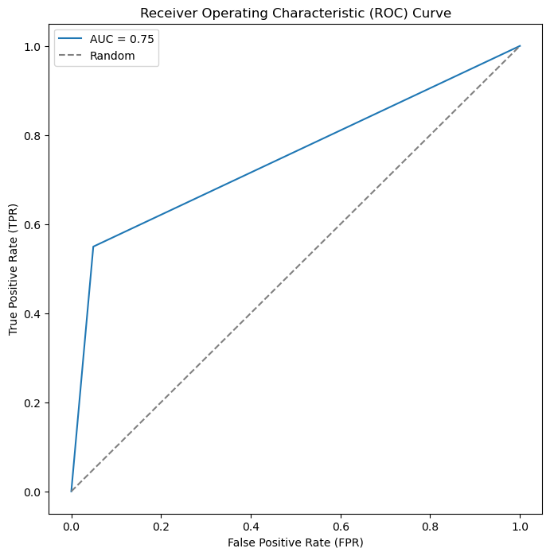

# Predicting Bank Churn with CatBoost Model

## Author: Linh Nguyen

### Project Overview

In this project, I aim to predict bank customer churn using advanced machine learning techniques, particularly leveraging the CatBoostClassifier. Customer churn, or the rate at which customers leave a service, is a critical concern for businesses, especially in the banking sector. Identifying and understanding the factors contributing to churn can help financial institutions take proactive measures to retain valuable customers.

### Dataset

The dataset contains various features such as customer demographics, transaction history, and interaction data. The target variable, 'Exited,' indicates whether a customer has churned (1) or not (0).

### Methodology

My approach involves preprocessing the data, utilizing CatBoost, a powerful gradient boosting algorithm, for predictive modeling, and evaluating the model's performance through metrics such as accuracy, precision, recall, and F1 score.

### Significance

- **Customer Retention:** Predicting churn enables banks to take preemptive actions to retain customers, potentially saving on acquisition costs.

- **Model Interpretability:** CatBoost provides insights into feature importance, aiding in understanding the drivers behind customer churn.

- **Optimizing Strategies:** With a robust predictive model, banks can tailor strategies to address specific factors leading to churn, improving overall customer satisfaction.


```python
import pandas as pd
```


```python
import numpy as np
```

# Data loading & profiling


```python
train_data = pd.read_csv('~/Downloads/playground-series-s4e1/train.csv')
```


```python
test_data = pd.read_csv('~/Downloads/playground-series-s4e1/test.csv')
```


```python
train_data.head()
```


<div>
<style scoped>
    .dataframe tbody tr th:only-of-type {
        vertical-align: middle;
    }

    .dataframe tbody tr th {
        vertical-align: top;
    }

    .dataframe thead th {
        text-align: right;
    }
</style>
<table border="1" class="dataframe">
  <thead>
    <tr style="text-align: right;">
      <th></th>
      <th>id</th>
      <th>CustomerId</th>
      <th>Surname</th>
      <th>CreditScore</th>
      <th>Geography</th>
      <th>Gender</th>
      <th>Age</th>
      <th>Tenure</th>
      <th>Balance</th>
      <th>NumOfProducts</th>
      <th>HasCrCard</th>
      <th>IsActiveMember</th>
      <th>EstimatedSalary</th>
      <th>Exited</th>
    </tr>
  </thead>
  <tbody>
    <tr>
      <th>0</th>
      <td>0</td>
      <td>15674932</td>
      <td>Okwudilichukwu</td>
      <td>668</td>
      <td>France</td>
      <td>Male</td>
      <td>33.0</td>
      <td>3</td>
      <td>0.00</td>
      <td>2</td>
      <td>1.0</td>
      <td>0.0</td>
      <td>181449.97</td>
      <td>0</td>
    </tr>
    <tr>
      <th>1</th>
      <td>1</td>
      <td>15749177</td>
      <td>Okwudiliolisa</td>
      <td>627</td>
      <td>France</td>
      <td>Male</td>
      <td>33.0</td>
      <td>1</td>
      <td>0.00</td>
      <td>2</td>
      <td>1.0</td>
      <td>1.0</td>
      <td>49503.50</td>
      <td>0</td>
    </tr>
    <tr>
      <th>2</th>
      <td>2</td>
      <td>15694510</td>
      <td>Hsueh</td>
      <td>678</td>
      <td>France</td>
      <td>Male</td>
      <td>40.0</td>
      <td>10</td>
      <td>0.00</td>
      <td>2</td>
      <td>1.0</td>
      <td>0.0</td>
      <td>184866.69</td>
      <td>0</td>
    </tr>
    <tr>
      <th>3</th>
      <td>3</td>
      <td>15741417</td>
      <td>Kao</td>
      <td>581</td>
      <td>France</td>
      <td>Male</td>
      <td>34.0</td>
      <td>2</td>
      <td>148882.54</td>
      <td>1</td>
      <td>1.0</td>
      <td>1.0</td>
      <td>84560.88</td>
      <td>0</td>
    </tr>
    <tr>
      <th>4</th>
      <td>4</td>
      <td>15766172</td>
      <td>Chiemenam</td>
      <td>716</td>
      <td>Spain</td>
      <td>Male</td>
      <td>33.0</td>
      <td>5</td>
      <td>0.00</td>
      <td>2</td>
      <td>1.0</td>
      <td>1.0</td>
      <td>15068.83</td>
      <td>0</td>
    </tr>
  </tbody>
</table>
</div>


```python
test_data.head()
```


<div>
<style scoped>
    .dataframe tbody tr th:only-of-type {
        vertical-align: middle;
    }

    .dataframe tbody tr th {
        vertical-align: top;
    }

    .dataframe thead th {
        text-align: right;
    }
</style>
<table border="1" class="dataframe">
  <thead>
    <tr style="text-align: right;">
      <th></th>
      <th>id</th>
      <th>CustomerId</th>
      <th>Surname</th>
      <th>CreditScore</th>
      <th>Geography</th>
      <th>Gender</th>
      <th>Age</th>
      <th>Tenure</th>
      <th>Balance</th>
      <th>NumOfProducts</th>
      <th>HasCrCard</th>
      <th>IsActiveMember</th>
      <th>EstimatedSalary</th>
    </tr>
  </thead>
  <tbody>
    <tr>
      <th>0</th>
      <td>165034</td>
      <td>15773898</td>
      <td>Lucchese</td>
      <td>586</td>
      <td>France</td>
      <td>Female</td>
      <td>23.0</td>
      <td>2</td>
      <td>0.00</td>
      <td>2</td>
      <td>0.0</td>
      <td>1.0</td>
      <td>160976.75</td>
    </tr>
    <tr>
      <th>1</th>
      <td>165035</td>
      <td>15782418</td>
      <td>Nott</td>
      <td>683</td>
      <td>France</td>
      <td>Female</td>
      <td>46.0</td>
      <td>2</td>
      <td>0.00</td>
      <td>1</td>
      <td>1.0</td>
      <td>0.0</td>
      <td>72549.27</td>
    </tr>
    <tr>
      <th>2</th>
      <td>165036</td>
      <td>15807120</td>
      <td>K?</td>
      <td>656</td>
      <td>France</td>
      <td>Female</td>
      <td>34.0</td>
      <td>7</td>
      <td>0.00</td>
      <td>2</td>
      <td>1.0</td>
      <td>0.0</td>
      <td>138882.09</td>
    </tr>
    <tr>
      <th>3</th>
      <td>165037</td>
      <td>15808905</td>
      <td>O'Donnell</td>
      <td>681</td>
      <td>France</td>
      <td>Male</td>
      <td>36.0</td>
      <td>8</td>
      <td>0.00</td>
      <td>1</td>
      <td>1.0</td>
      <td>0.0</td>
      <td>113931.57</td>
    </tr>
    <tr>
      <th>4</th>
      <td>165038</td>
      <td>15607314</td>
      <td>Higgins</td>
      <td>752</td>
      <td>Germany</td>
      <td>Male</td>
      <td>38.0</td>
      <td>10</td>
      <td>121263.62</td>
      <td>1</td>
      <td>1.0</td>
      <td>0.0</td>
      <td>139431.00</td>
    </tr>
  </tbody>
</table>
</div>


```python
train_data.info()
```

    <class 'pandas.core.frame.DataFrame'>
    RangeIndex: 165034 entries, 0 to 165033
    Data columns (total 14 columns):
     #   Column           Non-Null Count   Dtype  
    ---  ------           --------------   -----  
     0   id               165034 non-null  int64  
     1   CustomerId       165034 non-null  int64  
     2   Surname          165034 non-null  object 
     3   CreditScore      165034 non-null  int64  
     4   Geography        165034 non-null  object 
     5   Gender           165034 non-null  object 
     6   Age              165034 non-null  float64
     7   Tenure           165034 non-null  int64  
     8   Balance          165034 non-null  float64
     9   NumOfProducts    165034 non-null  int64  
     10  HasCrCard        165034 non-null  float64
     11  IsActiveMember   165034 non-null  float64
     12  EstimatedSalary  165034 non-null  float64
     13  Exited           165034 non-null  int64  
    dtypes: float64(5), int64(6), object(3)
    memory usage: 17.6+ MB


```python
train_data.describe()
```


<div>
<style scoped>
    .dataframe tbody tr th:only-of-type {
        vertical-align: middle;
    }

    .dataframe tbody tr th {
        vertical-align: top;
    }

    .dataframe thead th {
        text-align: right;
    }
</style>
<table border="1" class="dataframe">
  <thead>
    <tr style="text-align: right;">
      <th></th>
      <th>id</th>
      <th>CustomerId</th>
      <th>CreditScore</th>
      <th>Age</th>
      <th>Tenure</th>
      <th>Balance</th>
      <th>NumOfProducts</th>
      <th>HasCrCard</th>
      <th>IsActiveMember</th>
      <th>EstimatedSalary</th>
      <th>Exited</th>
    </tr>
  </thead>
  <tbody>
    <tr>
      <th>count</th>
      <td>165034.0000</td>
      <td>1.650340e+05</td>
      <td>165034.000000</td>
      <td>165034.000000</td>
      <td>165034.000000</td>
      <td>165034.000000</td>
      <td>165034.000000</td>
      <td>165034.000000</td>
      <td>165034.000000</td>
      <td>165034.000000</td>
      <td>165034.000000</td>
    </tr>
    <tr>
      <th>mean</th>
      <td>82516.5000</td>
      <td>1.569201e+07</td>
      <td>656.454373</td>
      <td>38.125888</td>
      <td>5.020353</td>
      <td>55478.086689</td>
      <td>1.554455</td>
      <td>0.753954</td>
      <td>0.497770</td>
      <td>112574.822734</td>
      <td>0.211599</td>
    </tr>
    <tr>
      <th>std</th>
      <td>47641.3565</td>
      <td>7.139782e+04</td>
      <td>80.103340</td>
      <td>8.867205</td>
      <td>2.806159</td>
      <td>62817.663278</td>
      <td>0.547154</td>
      <td>0.430707</td>
      <td>0.499997</td>
      <td>50292.865585</td>
      <td>0.408443</td>
    </tr>
    <tr>
      <th>min</th>
      <td>0.0000</td>
      <td>1.556570e+07</td>
      <td>350.000000</td>
      <td>18.000000</td>
      <td>0.000000</td>
      <td>0.000000</td>
      <td>1.000000</td>
      <td>0.000000</td>
      <td>0.000000</td>
      <td>11.580000</td>
      <td>0.000000</td>
    </tr>
    <tr>
      <th>25%</th>
      <td>41258.2500</td>
      <td>1.563314e+07</td>
      <td>597.000000</td>
      <td>32.000000</td>
      <td>3.000000</td>
      <td>0.000000</td>
      <td>1.000000</td>
      <td>1.000000</td>
      <td>0.000000</td>
      <td>74637.570000</td>
      <td>0.000000</td>
    </tr>
    <tr>
      <th>50%</th>
      <td>82516.5000</td>
      <td>1.569017e+07</td>
      <td>659.000000</td>
      <td>37.000000</td>
      <td>5.000000</td>
      <td>0.000000</td>
      <td>2.000000</td>
      <td>1.000000</td>
      <td>0.000000</td>
      <td>117948.000000</td>
      <td>0.000000</td>
    </tr>
    <tr>
      <th>75%</th>
      <td>123774.7500</td>
      <td>1.575682e+07</td>
      <td>710.000000</td>
      <td>42.000000</td>
      <td>7.000000</td>
      <td>119939.517500</td>
      <td>2.000000</td>
      <td>1.000000</td>
      <td>1.000000</td>
      <td>155152.467500</td>
      <td>0.000000</td>
    </tr>
    <tr>
      <th>max</th>
      <td>165033.0000</td>
      <td>1.581569e+07</td>
      <td>850.000000</td>
      <td>92.000000</td>
      <td>10.000000</td>
      <td>250898.090000</td>
      <td>4.000000</td>
      <td>1.000000</td>
      <td>1.000000</td>
      <td>199992.480000</td>
      <td>1.000000</td>
    </tr>
  </tbody>
</table>
</div>


```python
train_data.isnull().sum()
```


    id                 0
    CustomerId         0
    Surname            0
    CreditScore        0
    Geography          0
    Gender             0
    Age                0
    Tenure             0
    Balance            0
    NumOfProducts      0
    HasCrCard          0
    IsActiveMember     0
    EstimatedSalary    0
    Exited             0
    dtype: int64


```python
train_data.duplicated().sum()
```


    0


# EDA


```python
import matplotlib.pyplot as plt
import seaborn as sns

sns.histplot(train_data['CreditScore'], kde=True)
plt.show()
```

    /Users/linhnguyen/anaconda3/lib/python3.11/site-packages/seaborn/_oldcore.py:1119: FutureWarning: use_inf_as_na option is deprecated and will be removed in a future version. Convert inf values to NaN before operating instead.
      with pd.option_context('mode.use_inf_as_na', True):


    

    


```python
# Count plot for categorical variables
sns.countplot(x='Geography', data=train_data)
plt.show()
```


    

    


```python
# Exclude non-numeric columns
numeric_columns = train_data.select_dtypes(include=['number'])

# Correlation matrix for numerical variables
correlation_matrix = numeric_columns.corr()

sns.heatmap(correlation_matrix, cmap='coolwarm')
plt.show()
```


    

    


```python
sns.boxplot(x='Exited', y='Age', data=train_data)
plt.show()
```


    

    


```python
# Pair plots for selected variables
sns.pairplot(train_data[['CreditScore', 'Age', 'Balance', 'EstimatedSalary', 'Exited']], hue='Exited')
plt.show()
```

    /Users/linhnguyen/anaconda3/lib/python3.11/site-packages/seaborn/_oldcore.py:1119: FutureWarning: use_inf_as_na option is deprecated and will be removed in a future version. Convert inf values to NaN before operating instead.
      with pd.option_context('mode.use_inf_as_na', True):
    /Users/linhnguyen/anaconda3/lib/python3.11/site-packages/seaborn/_oldcore.py:1119: FutureWarning: use_inf_as_na option is deprecated and will be removed in a future version. Convert inf values to NaN before operating instead.
      with pd.option_context('mode.use_inf_as_na', True):
    /Users/linhnguyen/anaconda3/lib/python3.11/site-packages/seaborn/_oldcore.py:1119: FutureWarning: use_inf_as_na option is deprecated and will be removed in a future version. Convert inf values to NaN before operating instead.
      with pd.option_context('mode.use_inf_as_na', True):
    /Users/linhnguyen/anaconda3/lib/python3.11/site-packages/seaborn/_oldcore.py:1119: FutureWarning: use_inf_as_na option is deprecated and will be removed in a future version. Convert inf values to NaN before operating instead.
      with pd.option_context('mode.use_inf_as_na', True):


    

    


```python
from sklearn.ensemble import RandomForestClassifier
from catboost import CatBoostClassifier, Pool
from xgboost import XGBClassifier
from lightgbm import LGBMClassifier

from sklearn.model_selection import train_test_split
from sklearn.preprocessing import StandardScaler, LabelEncoder
from sklearn.metrics import accuracy_score, precision_score, recall_score, f1_score, confusion_matrix, classification_report
```

    /Users/linhnguyen/anaconda3/lib/python3.11/site-packages/dask/dataframe/_pyarrow_compat.py:23: UserWarning: You are using pyarrow version 11.0.0 which is known to be insecure. See https://www.cve.org/CVERecord?id=CVE-2023-47248 for further details. Please upgrade to pyarrow>=14.0.1 or install pyarrow-hotfix to patch your current version.
      warnings.warn(


# Data Preprocessing


```python
X= train_data.drop(['Exited', 'Surname', 'CustomerId'], axis=1)
y = train_data['Exited']
```


```python
cat_cols = ['Geography', 'Gender']
```


```python
le = LabelEncoder()
X[cat_cols] = X[cat_cols].apply(lambda col: le.fit_transform(col.astype(str)))
```

# Train and test data using CatBoost


```python
X_train, X_test, y_train, y_test = train_test_split(X, y, test_size=0.2, random_state=127)
```


```python
cbb=CatBoostClassifier(random_state=127, verbose=False)
```


```python
cbb.fit(X_train,y_train)
```


    <catboost.core.CatBoostClassifier at 0x165cdce10>


```python
y_pred = cbb.predict(X_test)
```


```python
# Classification Report
report = classification_report(y_test, y_pred)

print("Classification Report of CatBoostClassifier:\n")
print(report)
```

    Classification Report of CatBoostClassifier:
    
                  precision    recall  f1-score   support
    
               0       0.89      0.95      0.92     25987
               1       0.75      0.55      0.63      7020
    
        accuracy                           0.87     33007
       macro avg       0.82      0.75      0.78     33007
    weighted avg       0.86      0.87      0.86     33007
    


```python
conf_matrix = confusion_matrix(y_test, y_pred)
print(conf_matrix)
```

    [[24713  1274]
     [ 3163  3857]]


```python
import seaborn as sns
import matplotlib.pyplot as plt
from sklearn.metrics import confusion_matrix

conf_matrix = confusion_matrix(y_test, y_pred)

sns.heatmap(conf_matrix, annot=True, fmt='d', cmap='inferno', cbar=False)

plt.title('CatBoost Confusion Matrix')
plt.xlabel('Predicted')
plt.ylabel('True')
# Manually annotate TP, TN, FP, FN
for i in range(2):
    for j in range(2):
        plt.text(j + 0.5, i + 0.5, conf_matrix[i, j], ha='center', va='center', color='red' if i != j else 'green')

plt.show()
```


    

    


```python
from sklearn.metrics import roc_auc_score, roc_curve
import matplotlib.pyplot as plt

auc_roc = roc_auc_score(y_test, y_pred)

# Generate ROC curve
fpr, tpr, thresholds = roc_curve(y_test, y_pred)

# Plot ROC curve
plt.figure(figsize=(8, 8))
plt.plot(fpr, tpr, label=f'AUC = {auc_roc:.2f}')
plt.plot([0, 1], [0, 1], linestyle='--', color='gray', label='Random')
plt.xlabel('False Positive Rate (FPR)')
plt.ylabel('True Positive Rate (TPR)')
plt.title('Receiver Operating Characteristic (ROC) Curve')
plt.legend()
plt.show()
```


    

    


# Predict churn probability on unknowned labels


```python
X_test1 = test_data.drop(['Surname', 'CustomerId'], axis=1)
X_test1[cat_cols] = X_test1[cat_cols].apply(lambda col: le.fit_transform(col.astype(str)))

# Use predict_proba to get predicted probabilities
predicted_probabilities = cbb.predict_proba(X_test1)[:, 1]

# Create a DataFrame with IDs and predicted probabilities
result_df = pd.DataFrame({'id': range(165034, 165034 + len(X_test1)), 'Exited': predicted_probabilities})

# Display the result DataFrame
result_df.head()
```


<div>
<style scoped>
    .dataframe tbody tr th:only-of-type {
        vertical-align: middle;
    }

    .dataframe tbody tr th {
        vertical-align: top;
    }

    .dataframe thead th {
        text-align: right;
    }
</style>
<table border="1" class="dataframe">
  <thead>
    <tr style="text-align: right;">
      <th></th>
      <th>id</th>
      <th>Exited</th>
    </tr>
  </thead>
  <tbody>
    <tr>
      <th>0</th>
      <td>165034</td>
      <td>0.017332</td>
    </tr>
    <tr>
      <th>1</th>
      <td>165035</td>
      <td>0.853651</td>
    </tr>
    <tr>
      <th>2</th>
      <td>165036</td>
      <td>0.016875</td>
    </tr>
    <tr>
      <th>3</th>
      <td>165037</td>
      <td>0.214360</td>
    </tr>
    <tr>
      <th>4</th>
      <td>165038</td>
      <td>0.292184</td>
    </tr>
  </tbody>
</table>
</div>


